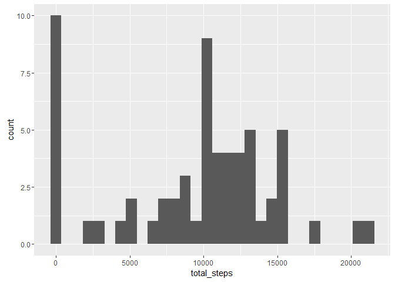
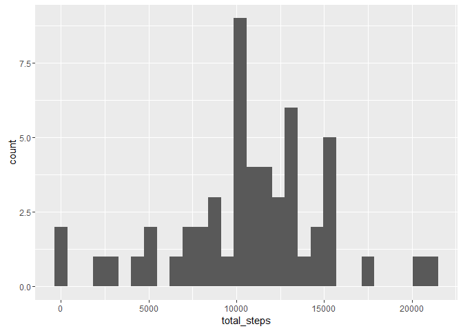
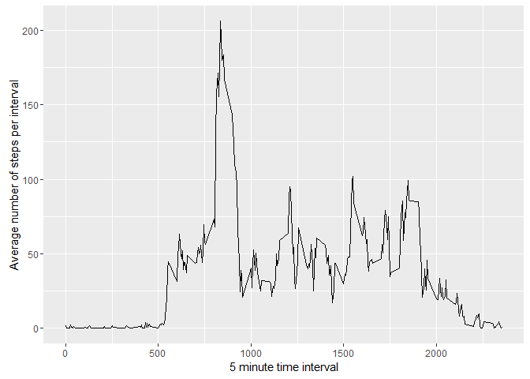
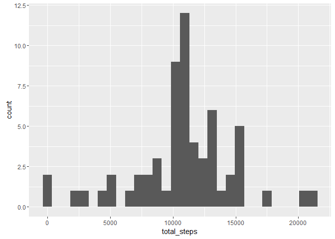
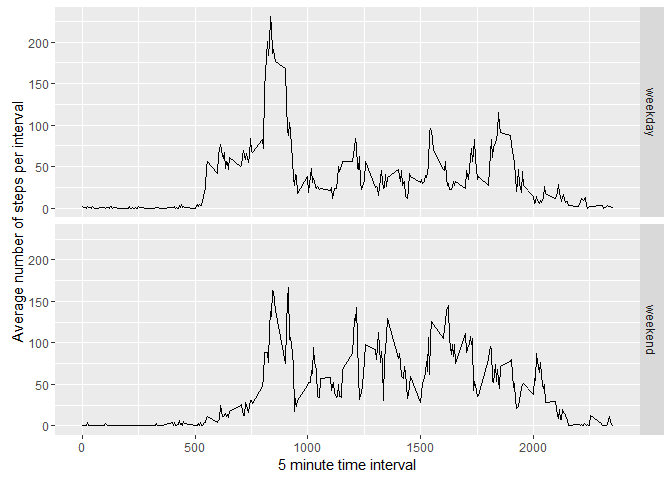

# Reproducible Research: Peer Assessment 1
Michael Abramovich

## Loading and preprocessing the data

First, we need to load some libraries.


```r
library(dplyr)
```

```
## Warning: package 'dplyr' was built under R version 3.2.5
```

```
## 
## Attaching package: 'dplyr'
```

```
## The following objects are masked from 'package:stats':
## 
##     filter, lag
```

```
## The following objects are masked from 'package:base':
## 
##     intersect, setdiff, setequal, union
```

```r
library(ggplot2)
```

Now, we can read in the .csv data.


```r
data <- read.csv("activity.csv", stringsAsFactors = FALSE)
```

We use dplyr to group and summarize steps per day in order to generate a histogram. We ignore missing values with na.rm = TRUE.


```r
steps_by_date <- group_by(data, date)
steps_by_date <- summarize(steps_by_date, total_steps = sum(steps, na.rm = TRUE))
```

We may now use ggplot to construct the histogram of steps by day.


```r
ggplot(steps_by_date, aes(x = total_steps)) + geom_histogram(bins = 30, na.rm = TRUE)
```



Note the histogram still reports "missing" days as having 0 steps because the missing date itself appears in the data frame. It is more correct to build a histogram excluding 0 values here, as these are really just masked missing values.  Let's try that.


```r
steps_by_date_no0 <- steps_by_date[steps_by_date$total_steps > 0,]
ggplot(steps_by_date_no0, aes(x = total_steps)) + geom_histogram(bins = 30, na.rm = TRUE)
```


## What is mean total number of steps taken per day?

It is straightforward to compute the mean and median number of steps per day, thought we should again ignore 0s in our mean.


```r
mean(steps_by_date_no0$total_steps, na.rm = TRUE)
```

```
## [1] 10766.19
```

```r
median(steps_by_date_no0$total_steps, na.rm = TRUE)
```

```
## [1] 10765
```

## What is the average daily activity pattern?

To provide a time series averaged by day, we again use dplyr to group the data by day.


```r
steps_by_interval <- group_by(data, interval)
steps_by_interval <- summarize(steps_by_interval, avg_steps_by_interval = mean(steps, na.rm = TRUE))
```

We now use ggplot to construct the time series plot.


```r
ggplot(steps_by_interval, aes(x = interval, y = avg_steps_by_interval)) + geom_line() +
    xlab("5 minute time interval") + ylab("Average number of steps per interval")
```



We can use which.max to retrieve the time interval with the maximum average steps.


```r
steps_by_interval[which.max(steps_by_interval$avg_steps_by_interval),]
```

```
## Source: local data frame [1 x 2]
## 
##   interval avg_steps_by_interval
##      (int)                 (dbl)
## 1      835              206.1698
```

Time interval 835 - 840 has the most average steps per day.

## Imputing missing values

We first investigate how many missing values (of steps) there are.


```r
sum(is.na(data$steps))
```

```
## [1] 2304
```

To reduce some of the bias of the missing data, we impute missing values. We do not use a sophisticated strategy here, simply using the mean steps per interval, averaged over all days, whenever the actual steps data is missing.

We use merge to add the average number of steps per interval to our data set with the missing data.


```r
imputed_data <- merge(data,steps_by_interval, by = "interval")
```

Now, wherever the value of steps is missing, we impute the average number of steps.


```r
imputed_data[is.na(imputed_data$steps),"steps"] =
    imputed_data[is.na(imputed_data$steps),"avg_steps_by_interval"]
```

We now delete the intermediate column of average steps now that the merge is complete.


```r
imputed_data$avg_steps_by_interval <- NULL
```

Finally, we reorder the new imputed data set by date so that it matches the original data set.


```r
imputed_data <- imputed_data[order(imputed_data$date,imputed_data$interval),]
```

We may now recreate the histogram with the imputed data.


```r
imputed_steps_by_date <- group_by(imputed_data, date)
imputed_steps_by_date <- summarize(imputed_steps_by_date, total_steps = sum(steps, na.rm = FALSE))

ggplot(imputed_steps_by_date, aes(x = total_steps)) + geom_histogram(bins = 30, na.rm = FALSE)
```



By inspecting the original and new histograms, we see that we have added occurrences at in the middle of the histogram (at the mean). As we have only added the daily mean number of steps to the data set, we would not expect the mean value of steps to change. Has it?


```r
#Original mean/median:

mean(steps_by_date_no0$total_steps, na.rm = TRUE)
```

```
## [1] 10766.19
```

```r
median(steps_by_date_no0$total_steps, na.rm = TRUE)
```

```
## [1] 10765
```

```r
#Mean/median with imputed data:

mean(imputed_steps_by_date$total_steps)
```

```
## [1] 10766.19
```

```r
median(imputed_steps_by_date$total_steps)
```

```
## [1] 10766.19
```

It hasn't! Hurray! Our imputation worked! The mean and median being the same is an arifact of using the average number of steps per day to impute the missing steps by interval. As it tends to be entire days that miss data, the mean value is imputed for every day, and the total number of steps becomes the same for many days. As that number is the mean, we get frequent observations of the mean, which fall around the middle of the ordered data set and become the median. Thus, the impact of imputing missing data slightly increases the median (and thus the distribution) of average daily steps, but does not impact the mean.

## Are there differences in activity patterns between weekdays and weekends?

To examine differences in activity between weekdays and weekends, we create introduce a factor variables that classifies days of the week as weekends or weekdays.

Let's add that as the day_type. First let's make all days "weekdays," and then we'll set Saturdays and Sundays to weekends.


```r
imputed_data$day_type <- "weekday"
imputed_data[weekdays(as.Date(imputed_data$date)) == "Sunday" |
             weekdays(as.Date(imputed_data$date)) == "Saturday","day_type"] <- "weekend"
```

Now we can set the day type to be a factor.


```r
imputed_data$day_type <- factor(x = imputed_data$day_type)
```

Let's check the levels of the day_type to see if that worked.


```r
levels(imputed_data$day_type)
```

```
## [1] "weekday" "weekend"
```

Awesome. It did.

Now let's see how activity differs by weekdays and weekdays (at least for the individual observed in this data set).

We again group and summarize the (imputed) data by interval and day_type.


```r
imputed_steps_by_interval <- group_by(imputed_data, interval, day_type)
imputed_steps_by_interval <- summarize(imputed_steps_by_interval, imputed_avg_steps_by_interval = mean(steps, na.rm = FALSE))
```

And now we can make our last plot, using ggplot as before.


```r
ggplot(imputed_steps_by_interval, aes(x = interval, y = imputed_avg_steps_by_interval)) + 
    geom_line() +facet_grid(day_type ~ .) +
    xlab("5 minute time interval") + ylab("Average number of steps per interval")
```



We have a couple of observations here. First, it looks like this individual was more active on weekday mornings, but perhaps more active overall on weekends than weekdays given more active afternoons. Note the individual tended to get active earlier on weekdays than weekends, perhaps sleeping in on weekends. We see a sharp increse in activity from 5 am on weekdays, compared to a much more gradual rise on weekends.

And we're done! Markdown is cool!
